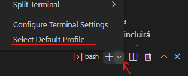
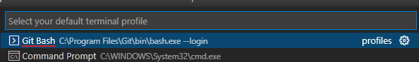
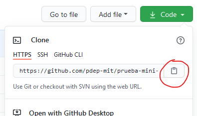
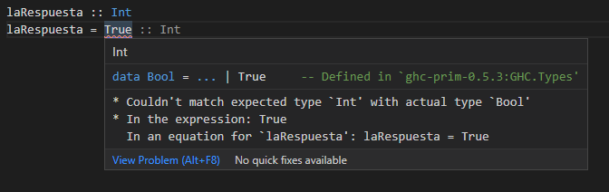
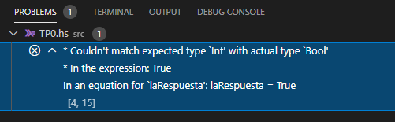
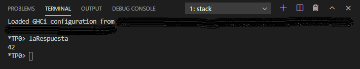
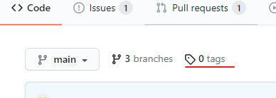
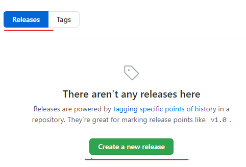
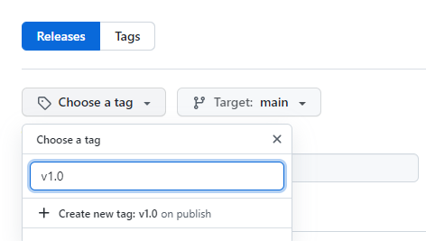
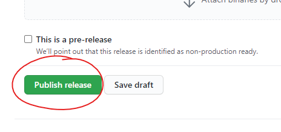

# Consigna TP0

## Objetivos

- :wrench: Que empieces a conocer algunas de las herramientas que vamos a estar usando durante la cursada, asegurando que te funcionen antes de que que sigamos avanzando con la práctica del paradigma funcional.
- :arrows_counterclockwise: Empezar a incorporar la ejecución de pruebas automáticas al flujo de trabajo, para asegurar que la solución propuesta cumpla con la funcionalidad esperada.
- :warning: Usar un entorno de desarrollo que te ayude a detectar y resolver problemas de forma temprana.
- :cloud: Usar un repositorio de código donde puedas subir tus cambios todas las veces que quieras, para que tus tutores puedan verlos y dejarte comentarios, así como también mantener un historial de lo que fuiste haciendo, sin miedo a perder tu trabajo.

> Tené en cuenta que las pruebas automáticas no se van a correr solamente en tu máquina, también se van a correr en un servidor luego de etiquetar el commit de entrega. La herramienta que se encargará de correr las pruebas, dejando los resultados disponibles para que tus tutores puedan verlos, se llama **GitHub Actions**.
>
> En caso de recibir mails de esta herramienta, no hace falta que te preocupes por eso. Para esta materia alcanza con que sepas que existe y que la vamos a estar usando para simplificar el trabajo de revisión de trabajos prácticos.

## Parte 1: Preparación de entorno de trabajo

Las herramientas a instalar son:
  - **Git**: para trabajar con versionado de código, hoy en día considerado el estándar de la industria para ese fin. [*Video introductorio*](https://www.youtube.com/watch?v=rRKe7l-ZNvM)
  - **Visual Studio Code (VSCode)**: editor de texto gratuito con herramientas integradas que te permiten desarrollar con mayor comodidad.
  - **Stack**: además de proveerte una instalación de Haskell, permite correr pruebas automáticas (o tests) muy fácil [*Video introductorio*](https://youtu.be/FCwwOM_7jZo).

> :exclamation: **IMPORTANTE:** si estás recursando la materia y ya tenías Haskell instalado, tené en cuenta que *stack* es una herramienta separada. Si no la usaste hasta ahora, no te saltees su instalación. Y si sí la usaste, asegurate de que esté actualizada usando:
>
> ```
> stack upgrade
> stack update
> ```

### Git

Primero que nada tenés que instalar Git para bajar y subir tu código al hacer las prácticas (y eventualmente para trabajar en equipo). Te dejamos el [link para descargar Git](https://git-scm.com/downloads) (elegí el que corresponda a tu sistema operativo).

Si estás en Windows, la instalación incluirá una herramienta llamada **Git Bash** que sirve para tener una consola de comandos similar a la de otros sistemas operativos. **Cada vez que requieras hacer algo por línea de comando, procurá usar Git Bash y no Power Shell/CMD para evitar confusiones**.

> :bulb: **Tip:** podés configurar el Visual Studio Code para usar Git Bash por defecto al abrir una terminal.
>
> Esto puede hacerse desde la solapa **Terminal** de VSCode de esta forma:
>
> 
>
> ... y luego tenés que elegir la opción correspondiente en la barra que aparecerá arriba de todo:
>
> 

En las partes siguientes de este trabajo vas a encontrar instrucciones sobre cómo usar git para esta primer etapa de la cursada.

### Stack

**Stack** es un conjunto de herramientas que facilita enormemente el desarrollo comercial y académico en Haskell. Se instala siguiendo [estos pasos](https://docs.haskellstack.org/en/stable/README/#how-to-install): elegí el tipo de instalación que corresponda para tu sistema operativo.

> Con la instalación de Stack **no es necesario instalar un compilador de Haskell separado (GHC)**.

### VSCode

Si bien se puede usar cualquier editor de texto para programar en Haskell, recomendamos trabajar usando Visual Studio Code que podés instalar [desde acá](https://code.visualstudio.com/).

Luego instalale las siguientes extensiones:
- [Simple GHC (Haskell) Integration - Id: dramforever.vscode-ghc-simple](https://marketplace.visualstudio.com/items?itemName=dramforever.vscode-ghc-simple), le agrega al editor el soporte básico para trabajar con Haskell.
- [Live Share - Id: ms-vsliveshare.vsliveshare](https://marketplace.visualstudio.com/items?itemName=MS-vsliveshare.vsliveshare), para facilitar el trabajo en equipo de forma sincrónica.

Una vez que tengas todo listo deberías ver estos íconos en la barra de abajo:

  

> :interrobang: Si el ícono de GHC no aparece inicialmente, es porque no detectó que es un proyecto Haskell todavía. Avanzá sobre la segunda parte del TP0 y en el proceso de usar Haskell debería inicializarse el plugin de Simple GHC.

Plugins opcionales:
- [Markdown Emoji - Id: bierner.markdown-emoji](https://marketplace.visualstudio.com/items?itemName=bierner.markdown-emoji), para que se muestren los emojis en la vista previa de los archivos `.md` :heart:
- [vscode-pdf - Id: tomoki1207.pdf](https://marketplace.visualstudio.com/items?itemName=tomoki1207.pdf), para mostrar archivos `.pdf`, por si las consignas de alguna práctica futura se encuentran en ese formato y te resulta más cómodo tener una vista previa integrada que abrir el archivo por afuera.

## Parte 2: Probar tu entorno

### Primeros pasos  :hatching_chick:

1. Abrí una consola (puede ser una nativa de tu sistema operativo o Git Bash) y cloná este repositorio con el comando: `git clone urlParaClonarEsteRepo`.

   La URL la podés sacar de GitHub como se muestra acá:

   

2. Navegá al directorio nuevo con el comando `cd nombreDelRepo` y luego ejecutá `code .` para abrir el VSCode en ese lugar. Alternativamente podés abrir el editor y elegir manualmente la carpeta que se te creó al clonar el repo.

    Ahí vas a poder ver y editar los archivos que están en este repositorio, así como ejecutar el código Haskell desde una terminal dentro del mismo editor.

3. Luego de abrir una terminal desde el menú Terminal del VSCode (o con `ctrl-shift-ñ`) ejecutá el comando `stack test`.

   > :coffee: Tené en cuenta que la primera vez que ejecutes este comando va a tardar un poco, porque tiene que descargar varias cosas para configurar el entorno de cero antes de poder correr las pruebas. Pero no te preocupes, que las veces siguientes no debería tardar en ejecutarse.

   Si todo anduvo bien (asumiendo que todavía no hiciste cambios en el `TP0.hs`) vas a ver algo como esto en la terminal:

    ```
    TP0
      La respuesta
        ... a la vida, el universo y todo lo demas ... FAILED [1]

    ... detalles del test fallido ...

    1 example, 1 failures
    ```

Si llegaste hasta acá sin sorpresas, felicitaciones!! :tada: Vas bien!

Es esperable que el test del TP0 **falle** con un error al ejecutar el comando `stack test`, ya que todavía no se implementó lo necesario en el archivo `src/TP0.hs` para que dicho test funcione.

A pesar de ese **error durante la ejecución**, de todos modos debería mostrarse el resumen de haber corrido de las pruebas: `1 example, 1 failure`. Esto indica que se corrió un solo caso de prueba, y hubo un resultado fallido.

> :interrobang: Si algo no te funcionó como se esperaba de esta primer parte y necesitás ayuda, contactanos. Hay un canal en Discord llamado **#troubleshooting** para ayudar con problemas técnicos.

### Trabajando con Haskell  :muscle:

El siguiente paso es jugar con Haskell para entender un poco más lo que está pasando y eventualmente hacer que ese test deje de fallar.

1. Abrí el archivo `src/TP0.hs`. Vas a encontrar que incluye una definición como esta:

   ```haskell
   laRespuesta :: Int
   laRespuesta = undefined
   ```

   En Haskell se puede usar la expresión `undefined` para postergar la implementación de algunas funciones que nos interesa que existan para usarlas desde otro lado, **permitiendo que el programa compile** de todos modos.

   Pero bueno, si al **ejecutar** el programa se evalúa esa expresión va a tirar **error**, como en este ejemplo :boom:

    > :warning: Para la ejecución de pruebas automáticas usando `stack test` es importante que te asegures siempre de que **todo el código del proyecto compila**. Tené esto en cuenta para los próximos trabajos prácticos.

2. En el archivo `src/TP0.hs` cambiá el valor de `laRespuesta` a `7`, guardá los cambios y volvé a correr los tests con `stack test`.

   Deberías ver que el resultado del test todavía no es exitoso, indicando que se esperaba que fuera `42` pero se obtuvo `7`.

   > :bulb: Con esta implementación ya no hay errores al tratar de conocer el valor para `laRespuesta`. Lo que falla en este caso es la prueba automática, que cuenta con una validación que no se cumplió.

3. Volvé a cambiar ese valor, ahora por el booleano `True` y guardá los cambios.

   Dado que hay un error **en tiempo de compilación**, porque el valor `True` no es del tipo esperado, correr los tests nuevamente con `stack test` **no debería ser posible**. Al ejecutar ese comando deberías ver detalles sobre el error de tipos en vez del resumen de ejecución de tests.

   > :white_check_mark: Si tu entorno con VSCode + el plugin **Simple GHC (Haskell) integration** está correctamente instalado, también debería marcarte el error de tipos al guardar los cambios, **antes** de intentar correr el programa dentro del mismo editor, subrayando el error.
   >
   > 
   >
   >También vas a encontrar esta información en la vista de problemas (si no la encontrás, usá `View -> Problems`). Esa es una gran ventaja de tener un buen entorno de desarrollo, nos ayuda a detectar problemas de forma temprana!
   >
   > 

4. Volvé a cambiar el valor para `laRespuesta`, esta vez usando el número `42`, y ejecutá el comando `stack test` nuevamente, para confirmar que el test del TP0 ahora sí funciona. El mismo debería mostrarse en verde, para indicar que funcionó como se esperaba, y el resumen final de ejecución debería decir: `1 example, 0 failures` ya que se ejecutó un solo caso de prueba y no hubieron fallos.

5. Además de correr las pruebas automáticas, podés usar `stack ghci` para ejecutar el intérprete de Haskell con todo el código que se encuentra en la carpeta `src` ya cargado.

   > :bulb: Más adelante habrán más archivos de Haskell en la carpeta `src`, por lo que si luego querés cargar solamente uno de esos archivos `.hs`, podés indicarlo con el comando:
   >
   > `stack ghci src/NombreDelArchivo.hs`.

   Probá correr el comando `stack ghci` o bien `stack ghci src/TP0.hs` en la consola. Deberías ver que se carga el programa y te permite ejecutar tu código en una consola de Haskell.

   Si en la consola de Haskell escribís `laRespuesta` y le das enter, debería responder con el valor correspondiente como se ve en este ejemplo:

   

    > :bulb: Si luego de ejecutar el comando `stack ghci` hiciste cambios en el código, podés escribir `:reload` o `:r` para que vuelva a cargar el/los archivos `.hs` sin tener que volver a levantar el intérprete de Haskell (ghci). Para salir del intérprete de Haskell y volver a la terminal de bash podés usar `:quit` o `:q`.

Para los siguientes trabajos se espera que trabajes de forma similar, validando con pruebas automáticas que tu programa funcione, pero con consignas más interesantes, claro :wink:

> :bulb: En caso de que te sirva para los próximos trabajos, si sólo querés ejecutar las pruebas para el mini-tp en el que estés trabajando en vez de las de todos los mini-tps juntos, podés especificarlo en el comando para ejecutar las pruebas de esta forma, usando el número de TP que te interese:
>
> `stack test --test-arguments "--match=TP0"`.

## Parte 3: Subir tus cambios a GitHub

Como estos cambios querés que se suban a GitHub, lo siguiente es ejecutar una serie de comandos de git en la consola.

En la terminal del sistema operativo (o Git Bash) corré los siguientes comandos para:

1. Agregar tus cambios a lo que será tu siguiente commit (podés verlo como un paquetito con los cambios que querés subir al repositorio):
   ```
   git add .
   ```

   > El `.` es para indicar que querés incluir los cambios de todos los archivos modificados del proyecto, que es lo que haremos normalmente.

2. Commitear tus cambios con un mensaje representativo, por ejemplo:
   ```
   git commit -m "Solución TP0"
   ```
   Tené en cuenta que eso sólo impacta a tu repositorio local (sigue estando sólo en tu máquina). Por eso lo siguiente es...
3. Subir tus cambios al repositorio remoto (GitHub):
   ```
   git push
   ```
4. Podés verificar que se subió correctamente entrando a la página de GitHub, al entrar a tu repositorio vas a encontrar el mensaje del último commit y cuándo fue que lo hiciste.

> :cyclone: Git tiene muchas más funcionalidades, en esta materia sólo usaremos las más básicas, incorporando un par más cuando amerite. Si en algún momento tenés problemas que no sabés resolver, avisanos por Discord así te damos una mano.
>
> Si querés profundizar sobre el uso de git, este [tutorial](https://www.youtube.com/watch?v=OgasfM5qJJE) explica todo (y un poco más) de lo que vas a necesitar para la cursada.

## Parte 4: Actualizar el README

El **README** de un proyecto es básicamente una carta de presentación. Es común que incluya información útil para otras personas, y también un indicador de si las pruebas existentes funcionan, comúnmente conocido como **Badge**.

1. En el archivo `README.md` que está en la raíz del proyecto completá con tu **nombre y apellido** donde se indica.

2. Agregá el **Badge de GitHub Actions** en el lugar indicado. Una vez que termines el TP0 tu repo GitHub va a mostrar el Badge que da información respecto a si todas las pruebas que se encuentran en este proyecto pudieron correrse sin problemas.

   El texto a copiar en el `README.md` de modo que aparezca el Badge de GitHub Actions correctamente es el siguiente:

   ```
   [](https://github.com/pdep-mit/mini-tps-funcional-2022-TuUsuarioDeGitHub/actions/workflows/build.yml)
   ```

   > :warning: ATENCIÓN: Asegurate de cambiar en los dos lugares en los que dice **TuUsuarioDeGitHub** por el nombre de usario que corresponda.

3. Luego de subir estos nuevos cambios al repositorio GitHub, creá un **tag** para etiquetar tu último commit. Esta acción disparará el proceso que corre las pruebas en el servidor de GitHub, luego de lo cual se actualizará la imagen del badge automáticamente.

   El etiquetado puede hacerse directamente desde GitHub, cuando estés por dejar un aviso a tus tutores de que realizaste la entrega en cuestión siguiendo estos pasos:

   - Hacer click en el link tags:

     

   - Elegir la opción Releases, y clickear en el botón para crear un nuevo release:

     

   - Indicar un número de versión:

     

     Podés elegir el número de versión como mejor te parezca. En el menú **Target** dejá la opción que aparece por defecto: **Target: main**.

   - Y así como está, no hace falta completar más nada, clickear el botón **Publish release** que está más abajo:

     

Eso es suficiente para que se dispare el proceso que corre las pruebas, y quede registrado el resultado de la ejecución en cuestión en base al código que está actualmente subido en tu repo, que es lo que nos interesa :+1:

## Parte 5: Avisar que terminaste el TP

Entrá a tu repo en GitHub y luego de verificar que tu solución se haya subido, incluyendo los cambios al `README.md`, avisanos creando un issue de esta forma:

1. En la página de issues de tu repo, creás un issue nuevo:
   

2. Clickeás en el botón para crear un issue de tipo **Entrega de TP**:
   

3. Completás el issue con la info correspondiente como se explica en el template (podés borrar el texto que ya viene, pero **no te olvides de arrobar a tus tutores** así les llega una notificación):
   

4. Luego de confirmar que está todo en orden, clickeás en el botón para crear el issue y listo! :tada:

De ahí en más, tus tutores van a darte el seguimiento necesario. Para los siguientes TPs la forma de entrega será la misma.

-------

Con esto oficialmente terminaste de configurar y conocer las herramientas que usaremos para funcional (y algunas también para los otros paradigmas). Si te quedaron dudas, no te las guardes, consultá!

Los próximos TP0s van a ser más livianos porque este te va a allanar el camino, prometido :sweat_smile:
